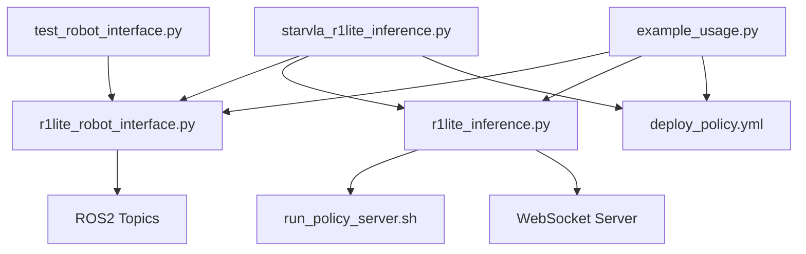

# R1LITE StarVLA 文件索引

> 完整的文件列表和快速导航

## 🎯 从哪里开始？

### 初次使用
1. **[QUICK_START.md](QUICK_START.md)** - 5分钟快速入门 ⚡
2. **[docs/STARVLA_INFERENCE_GUIDE.md](docs/STARVLA_INFERENCE_GUIDE.md)** - 完整操作指南 📘
3. 运行推理：`python starvla_r1lite_inference.py --task "你的任务"`

### 深入了解
1. **[PROJECT_STRUCTURE.md](PROJECT_STRUCTURE.md)** - 项目结构说明
2. **[docs/R1LITE.md](docs/R1LITE.md)** - R1LITE机器人手册
3. **[docs/README_ROBOT_INTERFACE.md](docs/README_ROBOT_INTERFACE.md)** - API技术文档

---

## 📂 文件分类

### ⭐ 核心推理代码

| 文件 | 说明 | 重要性 | 用途 |
|------|------|--------|------|
| **starvla_r1lite_inference.py** | StarVLA推理主脚本 | ⭐⭐⭐ | 生产环境推理 |
| **r1lite_robot_interface.py** | 机器人ROS2接口 | ⭐⭐⭐ | 硬件通信 |
| **r1lite_inference.py** | 模型推理客户端 | ⭐⭐⭐ | 模型调用 |

**使用场景**：真机部署、任务执行

---

### ⚙️ 配置文件

| 文件 | 说明 | 需要修改 | 关键参数 |
|------|------|----------|----------|
| **deploy_policy.yml** | 部署配置 | ✅ | checkpoint路径、端口号 |
| **run_policy_server.sh** | 服务器启动脚本 | ✅ | Python路径、GPU ID |
| **requirements.txt** | Python依赖 | ❌ | - |

**修改指南**：
- `deploy_policy.yml`: 修改`policy_ckpt_path`为你的模型路径
- `run_policy_server.sh`: 修改`star_vla_python`和`your_ckpt`路径

---

### 📖 文档（按推荐阅读顺序）

#### 入门文档
1. **[QUICK_START.md](QUICK_START.md)** 
   - 快速启动清单
   - 命令速查表
   - 适合：熟悉系统的用户

2. **[docs/STARVLA_INFERENCE_GUIDE.md](docs/STARVLA_INFERENCE_GUIDE.md)**
   - 完整推理流程
   - 详细步骤说明
   - 故障排查
   - 适合：首次使用或详细学习

#### 参考文档
3. **[PROJECT_STRUCTURE.md](PROJECT_STRUCTURE.md)**
   - 文件组织结构
   - 各文件用途说明
   - API速查
   - 适合：了解项目组织

4. **[docs/R1LITE.md](docs/R1LITE.md)**
   - R1LITE机器人操作手册
   - 系统启动流程
   - 相机配置
   - 数据录制和回放
   - 适合：底层操作

5. **[docs/README_ROBOT_INTERFACE.md](docs/README_ROBOT_INTERFACE.md)**
   - 机器人接口API文档
   - ROS2话题说明
   - 数据格式定义
   - 适合：开发者

#### 其他文档
6. **[README.md](README.md)** - 项目主文档
7. **[CHANGELOG.md](CHANGELOG.md)** - 版本更新日志
8. **[INDEX.md](INDEX.md)** - 本文件

---

### 💻 示例代码 (examples/)

| 文件 | 说明 | 适合人群 | 学习重点 |
|------|------|----------|----------|
| **example_usage.py** | 基础推理示例 | 初学者 | 推理流程 |
| **example_pose_control.py** | 姿态控制示例 | 进阶用户 | 位置控制 |

**学习路径**：
1. 先看`example_usage.py`了解基本流程
2. 再看`example_pose_control.py`学习姿态控制
3. 最后使用`starvla_r1lite_inference.py`进行生产部署

---

### 🧪 测试代码 (tests/)

| 文件 | 说明 | 使用时机 | 命令 |
|------|------|----------|------|
| **test_robot_interface.py** | 接口功能测试 | 部署前验证 | `python tests/test_robot_interface.py --duration 10` |
| **test.py** | 简单EE监控 | 调试定位 | `python tests/test.py` |

**推荐测试流程**：
```bash
# 1. 启动所有系统后
# 2. 先运行接口测试
python tests/test_robot_interface.py --duration 10.0

# 3. 查看实时位姿（可选）
python tests/test.py

# 4. 测试通过后再运行推理
python starvla_r1lite_inference.py --task "你的任务"
```

---

### 🛠️ 工具脚本 (tools/)

| 文件 | 说明 | 使用场景 | 依赖 |
|------|------|----------|------|
| **data_record_wholebody_go3s.py** | 数据录制工具 | 收集训练数据 | ROS2, H5py |
| **replay_h5.py** | H5文件回放 | 验证录制数据 | ROS2, H5py |

**注意**：
- 这些工具用于数据采集，不是推理必需
- 使用系统Python（`/usr/bin/python3`），不要用conda

---

## 🔄 文件依赖关系



---

## 📋 常用命令索引

### 启动系统
```bash
# Bot端启动
ssh r1lite@192.168.1.128
cd ~/galaxea/install/startup_config/share/startup_config/script/
./robot_startup.sh boot ../sessions.d/ATCStandard/R1LITEBody.d

# 相机启动（PC端）
IMAGE_WIDTH=1280 IMAGE_HEIGHT=720 FRAMERATE=30.0 \
/home/robot/Desktop/wangyinxi/WristInsta360_Project/scripts/wrist_cameras_start_all.sh

# 模型服务器
cd /home/robot/guchenyang/Code/StarVLA-Dev/examples/R1LITE/eval_files
bash run_policy_server.sh
```

### 运行推理
```bash
# 基础用法
python starvla_r1lite_inference.py --task "拿起红色方块"

# 完整参数
python starvla_r1lite_inference.py \
    --config deploy_policy.yml \
    --task "Pick up the cube" \
    --max-steps 300 \
    --freq 10.0 \
    --log-dir logs/my_task
```

### 系统验证
```bash
# 检查ROS2话题
ros2 topic list | grep -E "camera|motion"

# 检查相机频率
ros2 topic hz /hdas/camera_head/head/color/image_raw

# 检查模型服务器
netstat -an | grep 5694

# 测试接口
python tests/test_robot_interface.py --duration 10.0

# 查看相机画面
ros2 run image_view image_view --ros-args \
    -r image:=/hdas/camera_head/head/color/image_raw
```

---

## 🎓 学习路线

### Level 1: 入门使用（1-2小时）
1. ✅ 阅读 [QUICK_START.md](QUICK_START.md)
2. ✅ 按照快速启动清单操作
3. ✅ 运行 `test_robot_interface.py` 验证系统
4. ✅ 运行简单推理测试（10步）

### Level 2: 熟练操作（3-5小时）
1. ✅ 阅读 [STARVLA_INFERENCE_GUIDE.md](docs/STARVLA_INFERENCE_GUIDE.md)
2. ✅ 理解完整启动流程
3. ✅ 学习故障排查方法
4. ✅ 完成多个推理任务

### Level 3: 深入开发（1-2天）
1. ✅ 阅读 [README_ROBOT_INTERFACE.md](docs/README_ROBOT_INTERFACE.md)
2. ✅ 学习 `r1lite_robot_interface.py` 源码
3. ✅ 学习 `r1lite_inference.py` 源码
4. ✅ 自定义任务完成检测逻辑
5. ✅ 调整安全边界参数

### Level 4: 高级应用（持续）
1. ✅ 修改模型架构
2. ✅ 优化推理性能
3. ✅ 添加新功能
4. ✅ 集成其他传感器

---

## 📊 文件统计

| 类型 | 数量 | 说明 |
|------|------|------|
| Python脚本 | 8 | 推理、接口、示例、测试 |
| 配置文件 | 3 | yml、txt、sh |
| 文档 | 8 | md格式 |
| 总文件 | 19 | 不含__pycache__ |

---

## 🔍 快速查找

### 我想...

- **快速开始** → [QUICK_START.md](QUICK_START.md)
- **运行推理** → `python starvla_r1lite_inference.py --task "任务"`
- **了解API** → [docs/README_ROBOT_INTERFACE.md](docs/README_ROBOT_INTERFACE.md)
- **解决问题** → [docs/STARVLA_INFERENCE_GUIDE.md](docs/STARVLA_INFERENCE_GUIDE.md) 的故障排查章节
- **查看示例** → [examples/](examples/)
- **测试系统** → [tests/test_robot_interface.py](tests/test_robot_interface.py)
- **录制数据** → [tools/data_record_wholebody_go3s.py](tools/data_record_wholebody_go3s.py)
- **了解更新** → [CHANGELOG.md](CHANGELOG.md)

---

## 📞 获取帮助

1. **首先**：查看对应文档的"故障排查"章节
2. **然后**：检查日志文件 `logs/*/statistics.txt`
3. **最后**：提交Issue或联系技术支持

---

**索引版本**: v1.0  
**最后更新**: 2024-02-06  
**维护者**: StarVLA Team

---

**提示**：将此页面加入书签，便于快速查找！ 📌
